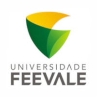

## Sobre

O grupo de usuários de Software Livre Tchelinux, em parceria com a [Universidade FEEVALE](https://www.feevale.br/), tem o prazer de convidar a comunidade para participar do evento que ocorrerá no dia **15 de Junho de 2019 a partir das 8:30h** na FEEVALE em Novo Hamburgo.

## Inscrições

 O evento tem **entrada franca**, porém os participantes são encorajados a doar 2kg de alimentos não perecíveis (exceto sal), que são doados a instituições de caridade da região. Os alimentos são recebidos no momento do credenciamento.

<a href="https://forms.gle/NT7EmSxYVjStmRBL9" target="_blank"><b>Clique aqui para fazer sua inscrição!</b></a>

## Certificados

Serão fornecidos certificados digitais para os participantes do evento, que confirmaram sua presença. Para obtê-los, você deverá utilizar o email fornecido na sua inscrição para o evento.

**Importante:** Não esqueça de confirmar sua presença no credenciamento.

## Programação

| 
 Horário 
 | 
 Sala 201   Desenvolvimento e Jogos 
 | 
 Sala 202   IoT, DevOps e SysAdmin  
 | 
 Sala 203   Segurança, Comunidade e Aplicações 
 |
|:--------------------------:|:-----------------------:|:-----------------------:|:-----------------------:|
| **08:30** <td colspan=4>
**Credenciamento**
 |
| **09:00** <td colspan=4>
**Abertura**  Todo o público     Equipe Tchelinux    
 |
| **09:30** |  [**Uma Não-Gentil Introdução ao Stream Processing**](#Uma_Não-Gentil_Introdução_ao_Stream_Processing)   Intermediário   Julio Biason  |  [**Git para Principiantes**](#Git_para_Principiantes)   Principiante   Fabio Beneditto |  [**Cerveja "Open Source"**](#Cerveja_"Open_Source")   Principiante   Thiago Becker |
| **10:20** |  [**App Web em 10 minutos com Web2py**](#App_Web_em_10_minutos_com_Web2py)   Principiante   Mauro Duarte |  [**Sistemas Embarcados e Buildroot**](#Sistemas_Embarcados_e_Buildroot)   Principiante   Rafael Jeffman |  [**Avanço dos serviços públicos, com o advento das tecnologias**](#Avanço_dos_serviços_públicos,_com_o_advento_das_tecnologias)   Intermediário   Edison Mattos da Silva Junior |
| **11:10** |  [**Desenvolvendo jogos com Python e pygame**](#Desenvolvendo_jogos_com_Python_e_pygame)   Principiante   Rafael Guterres Jeffman | [**Ansible e Terraform: Tornando a infra mais ágil**](#Ansible_e_Terraform:_Tornando_a_infra_mais_ágil)   Principiante   Cristhian Bicca | [**A importância de ir além do conhecimento técnico**](#A_importância_de_ir_além_do_conhecimento_técnico)   Principiante   Alisson Lima | 
| **12:00** <td colspan=4>
**Intervalo para Almoço**
 |
| **13:30** |  [**Como aprender Python partindo do zero usando apenas recursos online e livros**](#Como_aprender_Python_partindo_do_zero_usando_apenas_recursos_online_e_livros)   Principiante   Adriano Margarin |  [**Entendendo o Systemd**](#Entendendo_o_Systemd)   Intermediário   João Avelino Bellomo Filho | [**Como ter sucesso com Software Livre?**](#Como_ter_sucesso_com_Software_Livre?)   Principiante   Cristiano dos Santos Diedrich |
| **14:20** |  [**Porque Você Deve Aprender Rust**](#Porque_Você_Deve_Aprender_Rust)   Principiante   Julio Biason |  [**DevOps: Passado, presente e futuro**](#DevOps:_Passado,_presente_e_futuro)   Principiante   Cristiano dos Santos Diedrich |  [**Conhecendo os Side Channel Attacks**](#Conhecendo_os_Side_Channel_Attacks)   Principiante   Tiago Tatim Rodeghiero |
| **15:10** <td colspan=4>
**Coffee-Break**
 |
| **15:40** |  [**Introdução ao Spring Boot MVC no Java Servlet Stack com a aplicação Pet Clinic**](#Introdução_ao_Spring_Boot_MVC_no_Java_Servlet_Stack_com_a_aplicação_Pet_Clinic)   Principiante   Marco Aurélio Souza Mangan |  [**"Faz essa coisinha no arduino": Arduino e eletrônica DIY**](#"Faz_essa_coisinha_no_arduino":_Arduino_e_eletrônica_DIY)   Principiante   Thiago Becker |    [**"Essa câmera faz fotos muito boas, né?"**](#"Essa_câmera_faz_fotos_muito_boas,_né?")   Principiante   Rafael Guterres Jeffman | 
| **16:30** |  [**Nativo, híbrido ou PWA? o que escolher para meu app?**](#Nativo,_híbrido_ou_PWA?_o_que_escolher_para_meu_app?)   Principiante   Jefferson Cardoso |  [**Principais motivos pelos quais você precisa ter um backup do seu ambiente**](#Principais_motivos_pelos_quais_você_precisa_ter_um_backup_do_seu_ambiente)   Principiante   Giovani Razeira | [**Escrita acadêmica com o Latex**](#Escrita_acadêmica_com_o_Latex)   Principiante   Patrícia Kayser Vargas Mangan | 
| **17:20** <td colspan=4>
**Encerramento**  Todo o público     Equipe Tchelinux    
 |

## Palestras

### App Web em 10 minutos com Web2py 
Nesta palestra apresento o framework agil em python web2py para web. E também faço ao vivo a construção de um app ao vivo 

### Mauro Duarte 
[Mauro Duarte](https://mauroduarte.com) é professor, palestrante, autor e apaixonado por ensinar. Formado em WebDesign e programação e especialista em Educação Superior, tem uma grande experiência com ensino, lecionando a quase 20 anos nas áreas de TI, suporte, desenvolvimento, design e redes.

### Introdução ao Spring Boot MVC no Java Servlet Stack com a aplicação Pet Clinic 
Uma aplicação Web é um sistema distribuído de alta complexidade. Diversos frameworks de aplicação foram propostos para simplificar a tarefa de desenvolver esse tipo de aplicação. O Spring é um dos frameworks mais influentes dentro e fora do ecossistema Java. Sua implementação em código aberto adota conceitos inovadores como programação orientada a aspectos, programação por convenção e injeção de dependências. Além disso, o framework incentiva e divulga práticas como teste e compilação automáticos. A aplicação Spring Pet Clinic é um arquétipo que apresenta diversas soluções para compor uma aplicação Web contemporânea. A palestra é dirigida para iniciantes. Serão apresentados conceitos de programação e comentados guias selecionados disponíveis no site da spring.io. Ao final da palestra o participante deve ser capaz de compreender, implantar e alterar o código da aplicação Pet Clinic.

### Marco Aurélio Souza Mangan 
[Marco Aurélio Souza Mangan](https://github.com/masmangan) é Técnico em Processamento de Dados (1989) pela ETC/UFRGS, Graduado (1995) e Mestre (1998) em Ciência da Computação pelo II/UFRGS e doutorado em Engenharia de Sistemas e Computação pelo PESC/UFRJ (2006). Atualmente é professor da Escola Politécnica/PUCRS. Os principais interesses são ensino, teoria e prática de desenvolvimento de software.

### Desenvolvendo jogos com Python e pygame 
Jogar todo mundo joga. Programar, todo mundo pode. Jogar todo mundo treina. Programar, nem tanto. Mas para jogar é necessário que alguém desenvolva suas habilidades de programador. Nesse bate papo, porque ninguém mais tem paciência para palestras, será apresentada uma forma divertida de desenvolver a programação e conhecer a linguagem Python, construindo jogos, utilizando a biblioteca Pygame e ferramentas open source para desenvolver um jogo. 

### Rafael Guterres Jeffman 
[Rafael Guterres Jeffman](https://github.com/rafasgj) é fotógrafo, impressor e professor universitário. Leciona as disciplinas de algoritmos, estruturas de dados e desenvolvimento de jogos. Colaborou por anos com a distribuição GoboLinux. Entre seu projetos atuais, está um sistema de gerenciamento de ativos digitais multiplataforma, open source.

### Como aprender Python partindo do zero usando apenas recursos online e livros 
Como aprender python partindo do zero usando apenas recursos online e livros 

### Adriano Margarin 
[Adriano Margarin](https://fb.com/adrianomargarin) é Empreendedor e palestrante, Adriano Margarin divide suas experiências com o intuito de contribuir para a transformação de comunidades de software livre, ideias e atualizações do mercado no cenário da tecnologia.

Graduado em sistemas de informação, é desenvolvedor WEB e atua como consultor no setor. O foco reside em melhoras de desempenho, tempo de execução, expertise e conhecimento em desenvolvimento de software e suas aplicações.

"Hoje, minha maior motivação vem de solucionar problemas e mostrar que não existem limites para quem realmente sonha grande. Temos nos dedos e na mente ótimas ideias para desenvolver e estamos apenas no começo de uma grande jornada chamada de tecnologia". 

### Porque Você Deve Aprender Rust 
Rust (a linguagem, não o jogo) é uma linguagem que produz código em que a memória é protegida. Trazendo muitas das funcionalidades de linguagens funcionais, com abstrações de alto nível e performance semelhante a C, Rust é uma linguagem que você realmente deve aprender.

### Julio Biason 
[Julio Biason](https://functional.cafe/@juliobiason) é programador desde os 12 anos e já conheceu várias linguagens, mas nenhuma que fosse tão interessante quanto o Rust. 

### Nativo, híbrido ou PWA? o que escolher para meu app? 
Nativo ou híbrido ou PWA? Hoje são várias as opções para quem quer desenvolver apps, cada uma com seus prós e contras. Pretendo dar um overview sobre cada opção e mostrar a minha experiência com aplicativos híbridos (Ionic) e PWAs (Vue CLI). 

### Jefferson Cardoso 
[Jefferson Cardoso](https://www.linkedin.com/in/jefferson-cardoso) é Desenvolvedor Web e mobile na Prefeitura de Canoas, estudante do 7° semestre de Ciência da Computação na Feevale. 

### Uma Não-Gentil Introdução ao Stream Processing 
Stream Processing -- não relacionado com o stream de vídeos -- é uma forma de manter dados atualizados mesmo em tempo real de forma contínua. NEsta apresentação será apresentada o que é, pra que serve e como trabalhar com Stream Processing.

### Julio Biason 
[Julio Biason](https://functional.cafe/@juliobiason) é desenvolvedor desde os 12 anos.

### Git para Principiantes 
O mínimo que você precisa saber sobre Git, sistema de versionamento de arquivos. 

### Fabio Beneditto 
[Fabio Beneditto](https://about.me/fabiobeneditto) é Desenvolvedor Web, egresso da Feevale, Old School Nerd, simpatizante de F/OSS, segurança da informação e comunidades em geral. Voluntário Tchelinux desde 2016, é praticante de mototerapia.

### Sistemas Embarcados e Buildroot 
Buidroot é uma ferramenta para automação do processo de geração de um sistema Linux para dispositivos embarcados. O objetivo da palestra é dar uma visão geral dos componentes de um sistema embarcado que utiliza Linux e como gerar um sistema Linux embarcado com o Buildroot. 

### Rafael Guterres Jeffman 
[Rafael Guterres Jeffman](https://github.com/rafasgj) é fotógrafo, impressor e professor universitário. Leciona as disciplinas de algoritmos, estruturas de dados e desenvolvimento de jogos. Colaborou por anos com a distribuição GoboLinux. Entre seu projetos atuais, está um sistema de gerenciamento de ativos digitais multiplataforma, open source.

### "Faz essa coisinha no arduino": Arduino e eletrônica DIY
Uma visão geral sobre Arduino, eletrônica DIY e projetos executados.

### Thiago Rafael Becker 
[Thiago Rafael Becker](https://github.com/trbecker) é Senior Software Maintenance Engineer da Red Hat e queimador de capacitor.

### Entendendo o Systemd 
O Systemd é o software hoje utilizado pela maioria das distribuições Linux para a inicialização do sistema. Ele apresenta uma infinidade de melhorias em relação aos sofwares anteriores e, ao mesmo, tempo apresenta uma série de novos desafios. Essa apresentação visa identificar os pontos chave dele, enfatizando a nova forma de visualizar o funcionamento da inicialização, bem como mostrar algumas das ferramentas complementares a ele. 

### João Avelino Bellomo Filho 
[João Avelino Bellomo Filho](https://br.linkedin.com/in/jo%C3%A3o-avelino-bellomo-filho-0b2229a) é Tecnólogo em Processamento de Dados pela Universidade Católica de Pelotas, Mestre em Ciência da Computação pela Universidade Federal do Rio Grande do Sul. É usuário de Fedora Linux e atualmente é Desenvolvedor na Azion Technologies.

### DevOps: Passado, presente e futuro 
A vida de quem trabalha com tecnologia muda constantemente, a cada dia surgem mais e mais soluções, metodologias e formas de melhorar o nosso trabalho. DevOps é um dos diversos termos que se destacam nos últimos anos, então nada melhor do que conversarmos um pouco sobre ele, entender como ele pode ajudar as empresas atualmente e pensarmos juntos em como será não só DevOps mas sim, nossa vida com DevOps. 

### Cristiano dos Santos Diedrich 
[Cristiano dos Santos Diedrich](https://www.mundodocker.com.br) é entusiasta Open Source, se meu principal foco é ir atrás de ideias novas e torna-las realidade através de soluções simples e eficientes. É organizador do Meetup Docker Porto Alegre, Meetup DevOps/SRE Porto Alegre e DevOpsDays Porto Alegre.

### Ansible e Terraform: Tornando a infra mais ágil
Nessa palestra vamos demonstrar como funciona o Ansible e o Terraform e como podemos provisionar e configurar máquinas de maneira ágil, sem precisar programar em alguma linguagem como: PHP, Java, Python etc.

### Cristhian Bicca 
[Cristhian Bicca](https://www.mundodocker.com.br) é entusiasta e praticante da cultura DevOps, acredito que a melhor forma de aprender é compartilhando o conhecimento, então procuro sempre participar de eventos tanto como palestrante como também assistir, quando não estou trabalhando procuro passar o conhecimento através do seu [blog](https://www.mundodocker.com.br).

### Principais motivos pelos quais você precisa ter um backup do seu ambiente 
Se hoje você sofre uma indisponibilidade na sua operação, causada pela sua infraestrutura de TI, qual a previsão de retomada da sua operação? Nesta palestra vou apontar os principais motivos pelo qual você precisa ter uma cópia de segurança dos seus dados, as ferramentas de mercado que podem te ajudar nesta estratégia e algumas dicas.

### Giovani Razeira 
[Giovani Razeira](https://www.linkedin.com/in/razeira-giovani/)  Giovani Razeira atua na área comercial da Adentro Cloud Solutions e conduz um projeto de parceria entre o Data Center e software houses e desenvolvedores para identificar a melhor solução de infraestrutura em nuvem aos clientes. Comunicativo como é requerido a um profissional da área, encontro como maior motivação o feedback positivo de ter encontrado a melhor solução a cada demanda.

### Cerveja "Open Source"

A palestra apresenta outras maneiras como o movimento open source influenciou o mundo, focando em homebrweing: qual o processo, como a comunidade se forma, onde encontrar mais informações.

### Thiago Rafael Becker 
[Thiago Rafael Becker](https://github.com/trbecker) é Senior Software Maintenance Engineer da Red Hat e queimador de capacitor.

### Avanço dos serviços públicos, com o advento das tecnologias 
A palestra tem por objeto, apresentar a grande contribuição das tecnologias aos serviços públicos. Ainda em crescimento, se comparado com países, estados e municípios desenvolvidos, contudo, já há como mensurar a grande contribuição nos dias de hoje. Municípios que investem em tecnologia como base para melhoria de seus processos, têm se mostrado muito mais eficientes no serviço fim; Leia-se serviços entregues à comunidade.

### Edison Mattos da Silva Junior
[Edison Mattos da Silva Junior](https://www.linkedin.com/in/edisonmattos) é formado em Gestão da Tecnologia da Informação pela universidade Feevale, Pós-graduado em Gestão de Projetos de IENH, Pós-graduado em Gestão Pública de Anhanguera, tem experiência em gerenciamento de redes linux, trabalhou oito anos no Exército Brasileiro como gestor de TI. Atualmente trabalha como Assessor Parlamentar na Assembleia Legislativa.

### A importância de ir além do conhecimento técnico 
Ser um bom profissional na área da Tecnologia da Informação até pouco tempo atrás era sinônimo de ser incrível em habilidades exatas. No entanto, as pesquisas mais recentes sobre tendências no mercado de trabalho têm mostrado que isso está mudando. Atualmente, tanto empresas consolidadas como startups, se esforçam cada vez mais para encontrar profissionais com habilidades raras e de muito importância para seu sucesso. Entre elas podemos destacar comunicação, inteligência emocional, liderança, entre outras. Nesta palestra você irá entender o que são as Soft Skills e o que você pode fazer para desenvolvê-las. 

### Alisson Lima 
[Alisson Lima](https://www.instagram.com/alisson.plima/) é Coach, Trainer Programador Neurolinguista e CTO. Estudou diretamente com o pai do Coaching Timothy Gallwey e suas certificações em PNL são reconhecidas internacionalmente. Iniciou sua carreira na TI em 2008 e desde então ajuda empresas na criação de soluções para as áreas de automação, logística e fiscal. Em 2016, após perceber a grande dificuldade que muitos profissionais de TI possuem no desenvolvimento de habilidades não técnicas, como por exemplo a comunicação, gestão emocional, liderança, etc, decidiu trabalhar com o desenvolvimento desses profissionais utilizando ferramentas reconhecidas ao redor do mundo todo por ajudar pessoas a terem realização na sua vida pessoal e profissional, o Coaching e a PNL.

### Conhecendo os Side Channel Attacks 
Uma introdução aos Side Channel Attacks ou Ataques de Canal Lateral, conhecendo a metodologia dos ataques baseados em hardwares e como são aplicados. 

### Tiago Tatim Rodeghiero 
[Tiago Tatim Rodeghiero](https://www.facebook.com/tiago.tatim) é Editor da Hacker Security e estudante de Segurança da Informação.

### Como ter sucesso com Software Livre?

Ao longo de sua vida, quantas vezes você sentiu que havia conquistado o sucesso? Agora pense, quantas vezes você pensou em desistir? O objetivo dessa apresentação é trazer uma reflexão sobre o que é sucesso realmente e onde software livre pode ajudar você nessa caminhada.

### Cristiano dos Santos Diedrich 
[Cristiano dos Santos Diedrich](https://www.mundodocker.com.br) é entusiasta Open Source, se meu principal foco é ir atrás de ideias novas e torna-las realidade através de soluções simples e eficientes. É organizador do Meetup Docker Porto Alegre, Meetup DevOps/SRE Porto Alegre e DevOpsDays Porto Alegre.

### "Essa câmera faz fotos muito boas, né?" 
Durex, Xerox, Über e Photoshop, são marcas, não verbos ou substantivos. Nessa palestra vamos passar por uma parte obscura da fotografia digital, o gerenciamento de seus ativos digitais, que é ainda mais obscuro, no mundo do software livre. Sairemos da captura, passando pela organização, edição, indo até a publicação. E vamos garantir que esses arquivos não se percam em caso de desastres, e você tenha uma resposta positiva quando a esposa pergunta "tu não perdeu aquela foto, né?" 

### Rafael Guterres Jeffman 
[Rafael Guterres Jeffman](https://github.com/rafasgj) é fotógrafo, impressor e professor universitário. Leciona as disciplinas de algoritmos, estruturas de dados e desenvolvimento de jogos. Colaborou por anos com a distribuição GoboLinux. Entre seu projetos atuais, está um sistema de gerenciamento de ativos digitais multiplataforma, open source.

### Escrita acadêmica com o Latex 
O objetivo da palestra é apresentar uma visão geral e o potencial do Latex para a construção de textos técnicos e acadêmicos. Será apresentado como a estrutura do Latex pode auxiliar na construção de textos monográficos (trabalhos de conclusão, dissertações e teses) e textos técnico-científicos (artigos, relatórios e propostas de projetos). Também serão discutidas ferramentas para a edição e gestão de documentos e referências bibliográficas.

### Patrícia Kayser Vargas Mangan 
[Patrícia Kayser Vargas Mangan](http://lattes.cnpq.br/4892345821929149) possui Graduação (1995) e Mestrado (1998) em Ciência da Computação pela UFRGS e Doutorado (2006) em Engenharia de Sistemas e Computação pela COPPE/Sistemas da UFRJ. É professora do UNILASALLE/Canoas-RS, vinculada ao Programa de Pós-Graduação em Memória Social e Bens Culturais pertencendo a linha de Memória e Linguagens Culturais e Diretora de Pesquisa e Pós-graduação Stricto Sensu.

## Local

> **Universidade FEEVALE (Campus II)**
> RS 239, 2755
> Vila Nova
> Novo Hamburgo, RS

	<iframe src="https://www.google.com/maps/embed?pb=!1m14!1m8!1m3!1d13867.849659839487!2d-51.11827!3d-29.662865!3m2!1i1024!2i768!4f13.1!3m3!1m2!1s0x0%3A0xc0d78c5c5ba599b5!2sUniversidade+Feevale+-+C%C3%A2mpus+II!5e0!3m2!1sen!2sbr!4v1557113257562!5m2!1sen!2sbr" width="600" height="450" frameborder="0" style="border:0" allowfullscreen></iframe>

## Mapa da FEEVALE

  

## Apoio

### Institucional

### Patrocínio

### Divulgação

